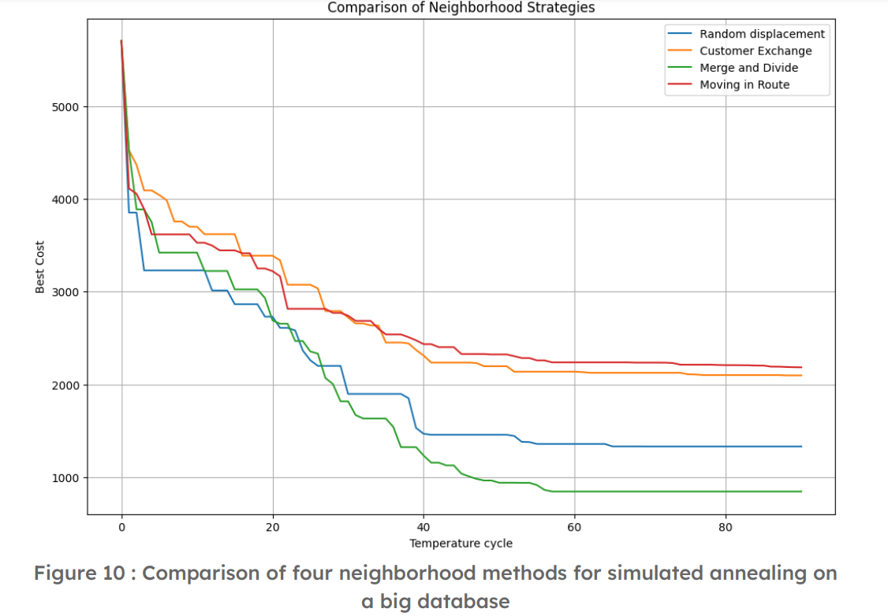

# ICO - Intelligence Collaborative Optimization

## Description
This project focuses on collaborative optimization for the **Vehicle Routing Problem (VRP)**, an NP-hard problem where the goal is to minimize costs associated with vehicle routes (travel distances, number of vehicles used). We started with the application of three classic metaheuristics (tabu search, simulated annealing, genetic algorithm) to solve this problem. Subsequently, we explored more collaborative approaches using multi-agent protocols (friend/enemy) and enhanced the performance with reinforcement learning methods (Q-learning).

## Details of the Algorithms Used

### 1. Metaheuristic Solutions
We first implemented three metaheuristic algorithms to solve the vehicle routing scheduling problem:

- **Tabu Search**:
  - This algorithm iteratively explores neighboring solutions and maintains a tabu list to avoid revisiting the same solutions.
  - Neighbors are generated by random permutations of clients, such as swapping two clients or moving a client to a different position.
  - Notable results: progressive reduction of route costs with each iteration.  
  

- **Simulated Annealing**:
  - Inspired by the metal cooling process, this algorithm alternates between exploration and exploitation through a decreasing temperature parameter.
  - Neighbors are generated by modifying existing routes using strategies like inter-route swaps or intra-route moves.
  - Results: a better balance between global exploration and rapid convergence.  
  

- **Genetic Algorithm**:
  - This algorithm mimics biological evolution mechanisms (selection, crossover, mutation).
  - An initial population of solutions is generated randomly and refined over iterations to improve solution quality.
  - Key parameters: population size, crossover, and mutation probabilities.  
  

### 2. Multi-Agent Protocols
To leverage the advantages of metaheuristics, we developed two collaborative agent protocols:

- **Friend Protocol**:
  - Agents share their best solutions through a collaborative pool.
  - This enables faster convergence to optimal solutions through guided exploration.  
  

- **Enemy Protocol**:
  - Agents operate in competition, with each team striving to outperform the other’s solutions.
  - This protocol encourages continuous improvement in agent performance.  
  

### 3. Reinforcement Learning with Q-learning
To further optimize the solution, we integrated reinforcement learning (Q-learning) into our metaheuristics:

- Neighbors are evaluated based on their cost, and the best solutions are favored to guide exploration.
- An E-greedy strategy balances exploitation of optimal solutions with exploration of new options.
- Results: significant improvement in solutions with notable reductions in total travel distances.  
  

## Key Results

### Metaheuristic Comparisons
- Metaheuristics were tested on datasets of varying sizes. For instance, with a dataset of 20 clients:
  - Tabu: optimal cost ≈ 260.
  - Simulated Annealing: optimal cost ≈ 255.
  - Genetic: optimal cost ≈ 250.  
  

- For a complete dataset of 107 clients, the genetic algorithm converged faster and yielded better solutions.  
  

### Friend Protocol
- The Friend Protocol improved solutions by 180 points compared to standalone metaheuristics.  
  

### Enemy Protocol
- With the Enemy Protocol, agent teams converged toward an optimal solution where both teams reached a plateau.  
  

### Reinforcement Learning
- Using Q-learning, the best solution achieved was ≈ 379 km (E-greedy = 0.02), compared to 530 km without Q-learning.  
  

### Final Results
- Standalone metaheuristics achieved a final cost of approximately 560.
- Combining SMA and Q-learning reduced the final cost to ≈ 350.  
  

## Authors
- Matthieu Richard, Ilyasse Chaouki, Antoine Deschamps, Virgile Devillers, Antoine Greaume

