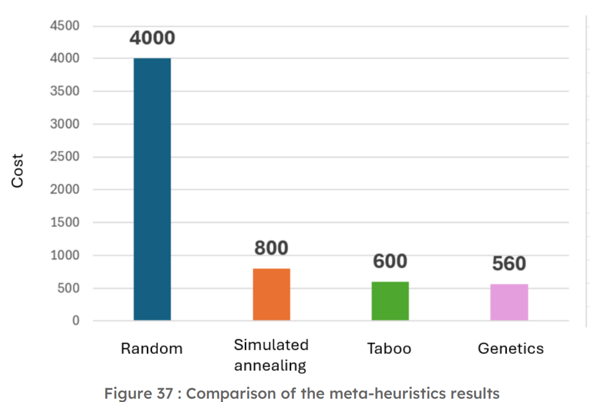

# ICO - Intelligence Collaborative Optimization

## Description

This project focuses on collaborative optimization for the **Vehicle Routing Problem (VRP)**, an NP-hard problem where the goal is to minimize costs associated with vehicle routes (travel distances, number of vehicles used). We started with the application of three classic metaheuristics (tabu search, simulated annealing, genetic algorithm) to solve this problem. Subsequently, we explored more collaborative approaches using multi-agent protocols (friend/enemy) and enhanced the performance with reinforcement learning methods (Q-learning).

---

## Details of the Algorithms Used

### 1. Metaheuristic Solutions

Three metaheuristic algorithms were implemented to tackle the vehicle routing problem. Each approach is detailed below with explanations and achieved average scores:

- **Tabu Search**:
  - Operates by iteratively exploring neighboring solutions while maintaining a tabu list to prevent revisiting.
  - Neighbors are generated through random permutations, such as swaps or relocations.
  - Achieved Average Score: **560**
  

- **Simulated Annealing**:
  - Inspired by the metal cooling process, balancing exploration and exploitation through a temperature parameter.
  - Implements strategies like inter-route swaps, intra-route moves, and merging/splitting routes.
  - Achieved Average Score: **590**
  

- **Genetic Algorithm**:
  - Mimics biological evolution through selection, crossover, and mutation.
  - Works with an evolving population to refine solutions iteratively.
  - Achieved Average Score: **540**
  

**Summary of Metaheuristics**:
A comparative graph highlights the strengths of each algorithm across execution times and convergence behaviors.

---

### 2. Multi-Agent Protocols

Collaborative optimization was achieved through **Friend** and **Enemy Protocols**, leveraging agent cooperation or competition:

- **Friend Protocol**:
  - Agents share their best solutions via a centralized Solution Pool.
  - Two filtering steps ensure diversity while focusing on promising solutions:
    1. Selecting the top-performing half of solutions.
    2. Balancing solution diversity for exploration and exploitation.
  - Each iteration allows agents to incorporate the pool's insights to refine their strategies.
  - Achieved Average Score: **400**

- **Enemy Protocol**:
  - Introduces competition where agents strive to outperform each other’s solutions.
  - Rival solutions are analyzed, and adversarial dynamics encourage exploration of new search spaces.
  - Achieved Average Score: **420**

---

### 3. Reinforcement Learning with Q-learning

Reinforcement learning was integrated to guide metaheuristic decisions dynamically:

- **Q-learning Enhancements**:
  - Neighbors are evaluated for their cost, prioritizing the most promising states.
  - Employs an E-greedy strategy to balance exploration (new paths) with exploitation (refining known solutions).
  - Achieved an average cost reduction to **350**.

---

## Final Results

The project culminated in a comprehensive comparison of all approaches, with a graph summarizing the performance metrics (costs, execution times, and convergence rates) of standalone metaheuristics, collaborative protocols, and reinforcement learning.

---

## Authors

- Matthieu Richard  
- Ilyasse Chaouki  
- Antoine Deschamps  
- Virgile Devillers  
- Antoine Greaume

